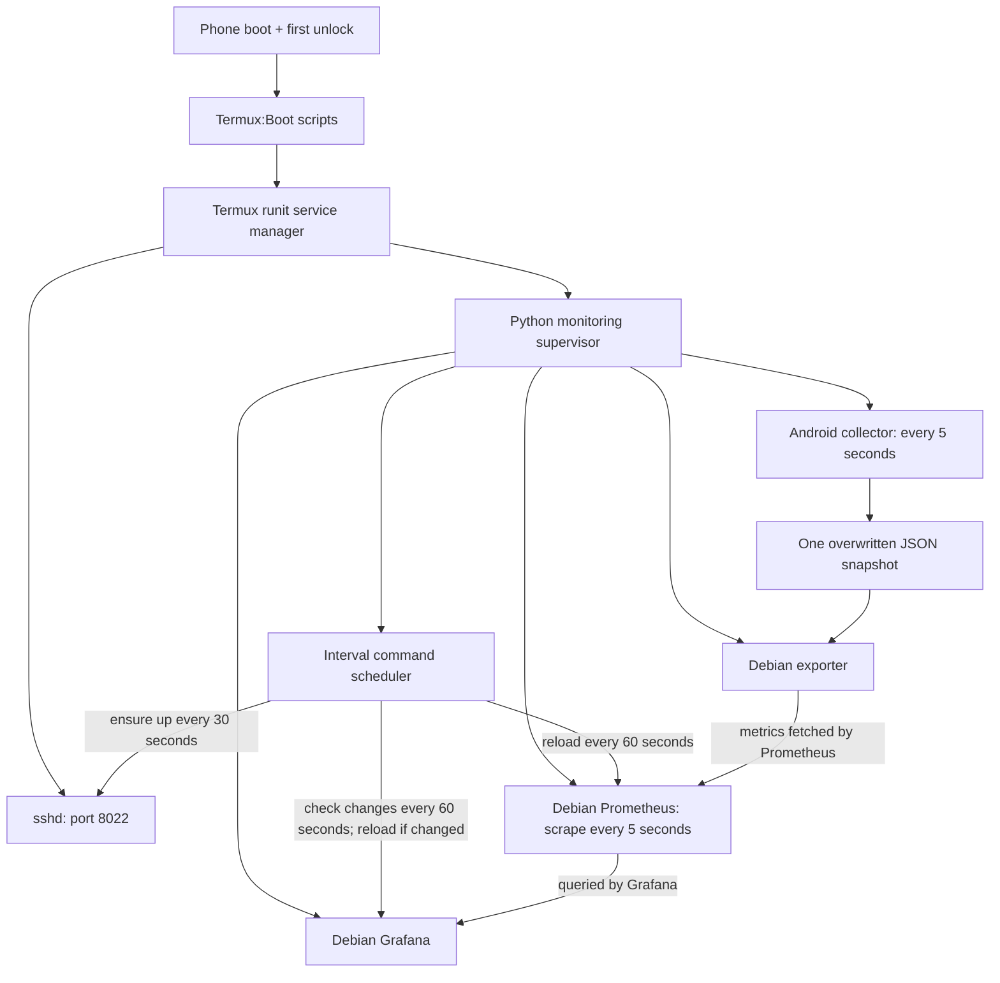

# Day-to-day operation

The phone runs independently; the laptop does not need to stay on. No additional
cron or Ansible installation is needed for this setup.

## What runs where

| Action | Where | When |
| --- | --- | --- |
| `python scripts/deploy-monitoring` | Laptop, repository root | After editing configs/scripts |
| `ssh phone` | Laptop | To administer the phone |
| Android/Termux/Debian setup | Phone, plus laptop SSH setup | Initial setup or replacement phone |
| ADB pairing and permission grants | Laptop communicating with Android | Initial administrative setup; reconnect for ADB-only tasks |
| `python ~/phome/scripts/memory-report.py` | Phone/Termux, optionally through SSH | Optional diagnostic |
| `python -m unittest discover -s tests -v` | Laptop, repository root | Verify relevant code changes |
| Supervisor, collector, exporter, Prometheus, Grafana, scheduler | Phone | Automatically, continuously |

**The deployment script is the only routine repo command needed to ship changes.**
Initial setup and optional diagnostics have separate commands; the laptop-side
deployment script itself is not a phone daemon. All scripts/configs are copied
to `~/phome` on the phone. Debian sees those same files as `/opt/phome`.

## Startup and recovery



Runit restarts SSH and the Python supervisor when they exit. The Python supervisor
restarts its Debian children; its scheduler also ensures SSH is enabled every
30 seconds. These are local process-recovery mechanisms. They cannot power on
the phone, unlock Android, repair a failed VPN or revive an entirely stopped
Termux app. Keep the [background/startup settings](setup.md) enabled.

## Current services

Current realme example (substitute a replacement phone's IP):

| Service | Address | Access |
| --- | --- | --- |
| SSH | `100.108.243.40:8022` | Laptop alias `ssh phone`, dedicated key |
| Grafana | [Phone dashboard](http://100.108.243.40:3000/d/phome-phone) | Tailnet, anonymous Viewer; admin required to edit |
| Prometheus | `127.0.0.1:9090` on phone | Localhost; seven-day retention |
| Phone exporter | `127.0.0.1:9101/metrics` on phone | Localhost |

Metrics include battery, temperature/voltage, storage, RAM, uptime, CPU frequency,
service scrape health and monitoring process memory. RAM available/used are
top-row stats as well as graphs. CPU utilization and network throughput remain
blocked by Android; their empty panels were removed. Administrative app grants
do not change those filesystem restrictions.

## Editing and deployment

1. Edit `config/` or `scripts/` locally.
2. Run `python scripts/deploy-monitoring` from the repository root.
3. Check Grafana's service health panel; allow about a minute after deployment.

Deployment validates and installs files, enables supervised SSH and restarts
monitoring to apply code/configuration. Data and secrets under `data/` are retained.
It is not a package updater, Git synchronizer or transactional rollback system.
It copies new/changed files; it does not delete removed files on the phone.

Files edited directly on the phone are production inputs: scheduler settings
reload automatically, Prometheus reloads every minute, Grafana provisioning
changes are checked every minute and reloaded only when changed, and
dashboard JSON is polled every five seconds. `grafana.ini`, startup flags and
Python code require a restart. Laptop deployment may overwrite phone-only edits;
keep lasting changes in the repository.

SSH and monitoring status, from the laptop:

```sh
ssh phone 'sv status "$PREFIX/var/service/sshd" "$PREFIX/var/service/phome-monitoring"'
```

Logs: `~/phome/data/logs/SERVICE/current` for monitoring/scheduler;
`$PREFIX/var/log/sv/sshd/current` for SSH. Secrets: `~/phome/data/grafana.env`,
mode 600. Do not copy that file or private keys into the repository.

## Completed and remaining verification

- Verified: SSH keys and Tailscale; initial manual reboot/first unlock recovery.
- Verified: five-second collection/scraping, Grafana panels, all three scrape
  targets healthy, one-week retention setting and scheduled reloads.
- Verified: deployment, supervisor child recovery and scheduler non-overlap,
  config reload and timeout handling.
- Verified on the phone: killed the supervised SSH listener and reconnected
  after runit's restart; deliberately stopped the SSH service and reconnected
  after the scheduler brought it up again.
- Android permissions and reversible search-app cleanup are recorded in
  [Android access](android-access.md); memory measurements are in [Monitoring](monitoring.md).
- Still pending: a physical reboot test of the latest monitoring/SSH service
  setup, overnight operation, external-network access and key-expiry confirmation.

About 2 GiB available RAM is a current reading, not a fixed capacity ceiling.
Memory tuning and further Android cleanup are paused.

Grafana memory growth was subsequently reported and mitigated with a soft Go
memory budget, disabled unused alerting and provisioning reloads only on change.
See [the investigation](monitoring.md#grafana-memory-growth-investigation-2026-10-01).
Other memory cleanup remains paused. Deployment restarts monitoring deliberately
and briefly makes Grafana unavailable; that is not a crash-recovery event.
The scheduler now also checks the CPU wake lock every minute and restores it
when PowerManager reports it absent. Vendor power restrictions can still interfere.

Next work: smart-plug battery charging (confirm plug model/local control first),
then a framework for hosting apps on the phone. Neither is implemented yet.
